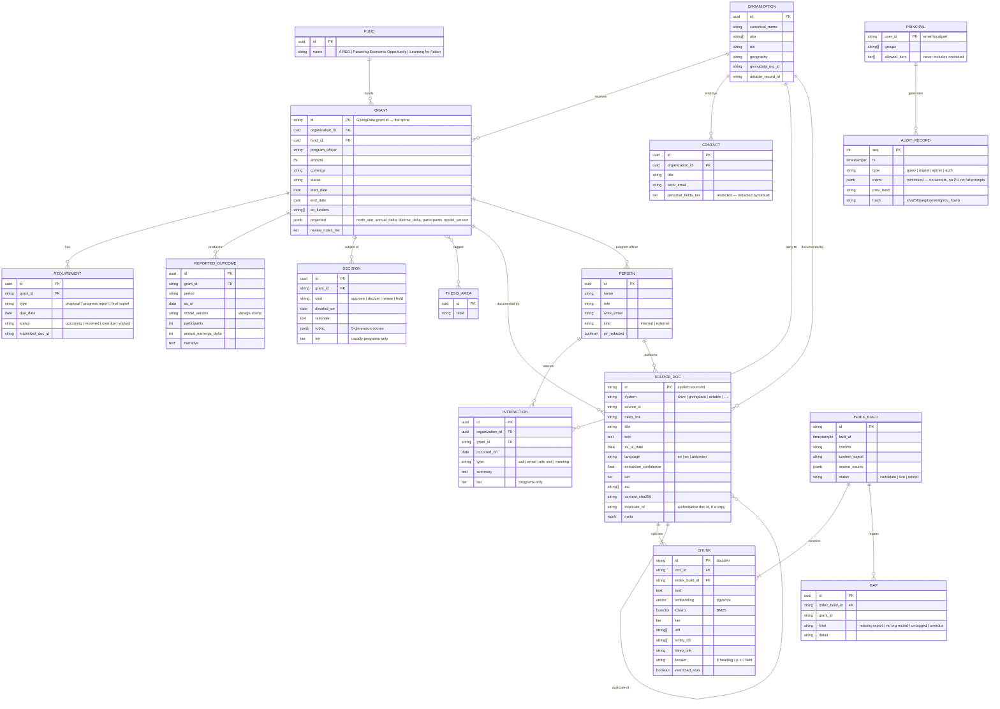

# Compass — Data Model (ERD)

Compass is a **derived** store. Every row traces to a source system that remains
authoritative and read-only. The index can be wiped and rebuilt from source at any time.

## Entity–relationship diagram

## Canonical entities & join keys

| Entity | Primary key | Resolved from |
|---|---|---|
| **Grant** | GivingData grant id | GivingData (native); Drive filenames/bodies; Airtable cross-ref field |
| **Organization** | uuid; keyed on normalized name + `givingdata_org_id` | all four systems (fuzzy match on name → review queue) |
| **Person** | uuid; name + email | GivingData contacts, Airtable contacts, Drive authors/comments, interaction attendees |
| **Fund / Thesis area** | uuid on label | GivingData (native), Drive folder path, Airtable tags — mapped to one controlled vocabulary |

## Sensitivity tiers (on every SOURCE_DOC and CHUNK)

`team` · `programs-only` · `restricted` (not indexed — stub only) · `never-ingest` (absent entirely).
`acl text[]` holds the principals (`group:programs`, `user:x`, `*`) allowed to read the source.

## Source-of-truth map (which system wins per fact)

| Fact | Authoritative | Fallback |
|---|---|---|
| Grant amount, dates, status | GivingData GRANT | executed agreement (DocuSign) |
| Projected impact | GivingData GRANT.projected | the impact model sheet |
| Reported / actual outcome | GivingData REPORTED_OUTCOME | the final report SOURCE_DOC in Drive |
| Decision rationale | Drive diligence memo | GivingData DECISION.rationale |
| Organization profile / relationship | Airtable | GivingData ORGANIZATION |

## Retention

Source data: never modified or deleted by Compass. CHUNK / INDEX_BUILD: rebuilt on each
promotion; old builds retired then purged. AUDIT_RECORD: retention-bounded per the
Foundation's schedule, reviewed with counsel; the hash chain and off-host copy are
permanent-until-policy.
