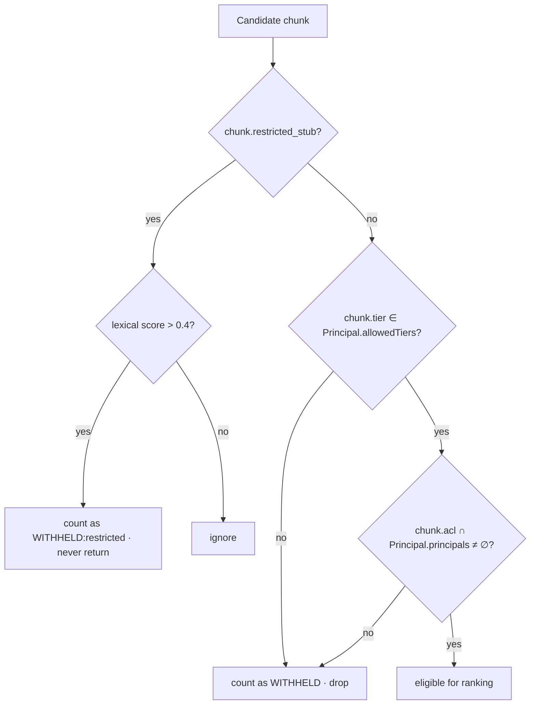
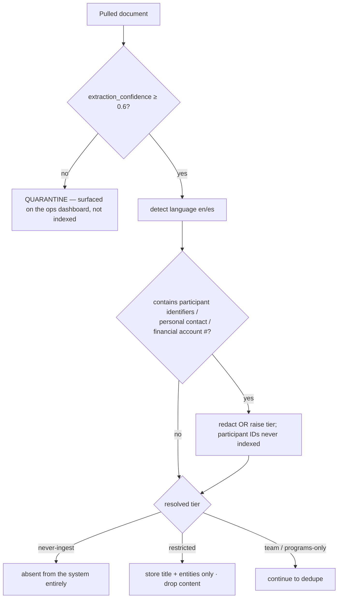
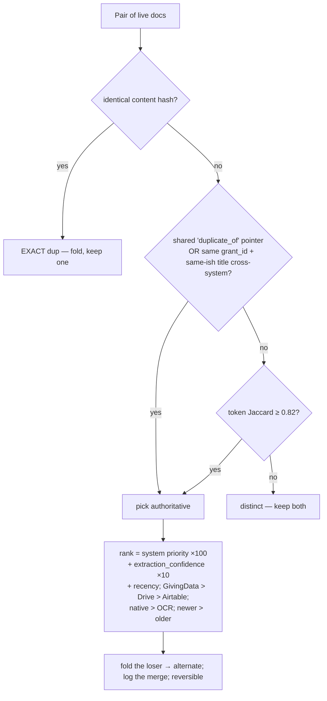
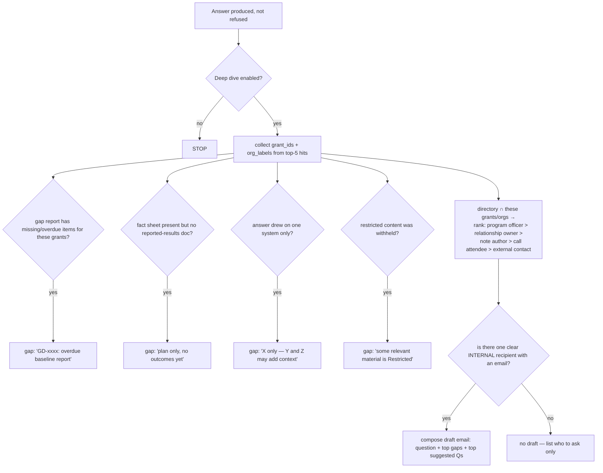
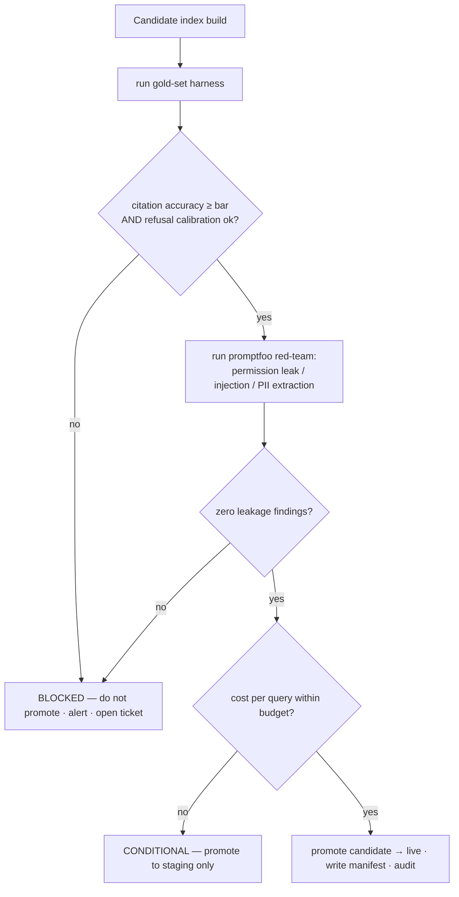

# Compass — Conditional Logic Trees

The deterministic decision logic that sits **outside the model**. These are enforced in
code (`src/retrieval/*`, `src/pipeline/*`), tested by `npm run eval` / `npm run security`,
and must never be delegated to a prompt.

---

## 1. Answer decision tree (the query path)

```mermaid
flowchart TD
    Q[Question + verified Principal] --> R[Hybrid retrieve, ACL-filtered in SQL]
    R --> W{Any passages withheld?}
    W -- yes --> WT[record withheld count + tiers]
    W -- no --> C0
    WT --> C0{hits.length == 0?}
    C0 -- yes --> P0{withheld includes a non-team tier?}
    P0 -- yes --> RF1[REFUSE — permission: N passages outside your scope]
    P0 -- no --> RF2[REFUSE — nothing in what I can see answers this]
    C0 -- no --> C1{restricted stub matched AND
    its score ≥ 0.7 × best real hit?}
    C1 -- yes --> RF3[REFUSE — topic is Restricted, not indexed,
    request via COO office]
    C1 -- no --> C2{top hit weak?
    bm25 < 1.6 AND semantic < 0.08}
    C2 -- yes --> RF2
    C2 -- no --> GEN{LLM configured?}
    GEN -- no --> EXT[EXTRACTIVE answer — passages + [n] citations,
    labelled 'no generative model']
    GEN -- yes --> LLM[send passages + question ONLY → model]
    EXT --> GRADE
    LLM --> GRADE[grade confidence]
    GRADE --> G1{top bm25 > 3 AND ≥ 2 strong matches?}
    G1 -- yes --> HI[confidence = HIGH]
    G1 -- no --> G2{≥ 1 strong match?}
    G2 -- yes --> MED[confidence = MEDIUM — 'verify against sources']
    G2 -- no --> LO[confidence = LOW — 'a lead, not an answer']
    HI --> OUT
    MED --> OUT
    LO --> OUT
    OUT[attach coverage line + withheld + citations] --> AUD[append to audit log]
```

**Rules encoded here:** refusal beats a weak answer; a Restricted match beats a mediocre
real answer; the model is only ever handed the retrieved passages; confidence is graded
from retrieval strength, not from the model's self-report.

---

## 2. Permission filter (the security boundary)



`Principal.principals = {user:<id>} ∪ {group:<g> for g in groups} ∪ {*}`.
`restricted` is never in `allowedTiers` for any principal in v1.

---

## 3. Ingestion tier & quality gate (per document)



---

## 4. De-duplication & authoritative-copy selection



---

## 5. "Deep dive" trigger logic (toggleable; off the answer)



---

## 6. Release gate (per index build / per deploy)



**Allowed outcomes:** `READY` · `CONDITIONAL` · `BLOCKED`. A leakage finding is always
`BLOCKED`, no exceptions.
