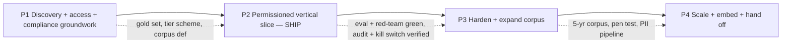
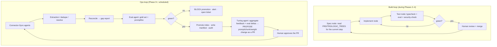

# Compass — Sequential Implementation Roadmap

Steps, not a calendar (matches the Foundation's "bias for action / iteration"). Each phase
is done when its **exit criteria** pass. Progress is reported as *ahead / on / behind* the
next criterion. Quick turnaround is served by shipping a thin vertical slice early
(Phase 2) and widening.

The three deferred deliverables from the security review gate production — they are called
out in the exit criteria, not left implicit.

---

## Build sequencing (dependency order)

### Phase 1 — Discovery, access & compliance groundwork
- Stakeholder interviews (`E_Discovery_Questions.md`); confirm 3–5 design partners; name the DRI/data owner.
- Inventory the four systems: objects, fields, permissions, retention, data quality (`F_Source_Data_Inventory.md`).
- Least-privilege, scoped access: Drive service account (Shared-Drive allowlist), GivingData read creds/export, Airtable read token.
- Executed LLM enterprise agreement (zero retention) + DPA; secondary-use / grant-agreement review with counsel; CO/KE transfer determination.
- Draft the four-tier sensitivity scheme; agree the `never-ingest` list; **data owner signs off**.
- Build the first ~50-question gold set with verified answers + expected sources.
- Define the v1 corpus (GivingData 2022–2026 + 2–3 Shared Drives + matching Airtable orgs) and the 6-month success metric.
- **Exit:** signed scoped access to ≥ Drive + GivingData; executed LLM agreement; agreed corpus + success metric; tier scheme approved by the data owner; gold set v1 exists.

### Phase 2 — Permissioned vertical slice (ship early)
- Drive + GivingData connectors behind `SourceAdapter`; incremental sync.
- Data-quality pipeline on ~30 grants: parse/OCR gate, PII scan, tier gate, exact/near/cross-system dedupe, entity graph, gap report.
- Postgres + pgvector; hybrid retrieval; **retrieval-time ACL filter in SQL**; `restricted` excluded (stub only).
- BGE-M3 embeddings; bge-reranker.
- Web app: Google OIDC, session, answer + inline deep-link citations + coverage line + confidence + Deep dive + grantee dossier.
- Security controls **in this slice, not deferred**: SSO+MFA, secrets in the manager, tamper-evident audit log, kill switch, step-up for admin.
- 3–5 design partners on real questions; structured weekly feedback.
- **Exit:** partners answer real questions with correct citations; gold-set citation accuracy ≥ bar; **zero permission-leak findings** in a promptfoo red-team; audit log + kill switch verified; per-user rate/cost limits live.

### Phase 3 — Harden & expand the corpus
- Airtable connector; Notion + the impact model as candidate adds (governance review first).
- PII/sensitivity pipeline productionized; multilingual (Spanish) retrieval; OCR quality checks.
- Eval + red-team wired into CI as a promotion gate; anomaly-detection alerts live; audit records streamed off-host.
- Backfill the corpus to five years; version/conflict handling for divergent report copies; entity-resolution review queue in the admin console.
- Third-party penetration test; findings remediated; controls matrix to SOC 2 / NIST CSF coverage.
- Broaden to the full Programs + Impact group.
- **Exit:** five-year corpus with a clean reconciliation report; **the 6 security-review items closed** (injection test set passing, PII scanner live, rate/cost limits, OAuth callback + real creds + off-host audit, pen test remediated, CO/KE review done); full team onboarded; promotion gate automatic.

### Phase 4 — Scale, embed & hand off
- Additional surface: Slack/Zoom answer bot or a GivingData embed (where the team actually works).
- Feedback-driven tuning loop (see agent orchestration below).
- Usage / trust / cost dashboards for leadership.
- Expo (iOS + Android) native app.
- Full documentation: this set + runbook + incident response + controls matrix.
- Named internal owner trained and operating it.
- **Exit:** documented, handoff-ready system with a named internal owner; leadership decision packet on Zoom Chat + org-wide rollout; tabletop incident exercise completed; **release decision on record: READY**.

---

## Agent orchestration for the build & operations

**The build itself is agent-assisted; the product's runtime is not agentic.** Two loops.

- **Sequential vs. loop:** the pipeline is a **sequential DAG** with **two loops** — the
  eval gate (re-run until green or escalate) and the weekly tuning loop (propose →
  human-approve → measure). Framework: **LangGraph** (explicit state, checkpointing,
  human-in-the-loop pause).
- **What no agent may do:** write to a source system; promote an index build without a
  passing eval + red-team; apply a tuning change to production without human approval;
  change a sensitivity tier.
- **"Self-improving"** = the retrieval config, prompt, and chunking evolve from the
  feedback + eval loop, always gated by the gold set and always via a reviewed PR. The
  system gets better at *retrieving and citing*, never at *deciding*.

---

## Team & pace

- **Fellow (the builder):** owns the whole thing; managed services over bespoke infra; runbook + this doc set from day one.
- **Design partners (2, ~2 hrs/week):** real questions, the gold set, adoption feedback.
- **Contractor, spot (Phase 3):** the penetration test.
- **Named internal owner:** identified before the fellowship midpoint; shadows Phase 3–4; owns it after.

If the plan runs behind at any exit gate, the response is to **narrow the corpus or the
user group**, never to skip a security exit criterion.
