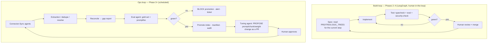

# Compass — Implementation Roadmap & Step Tracker

**How to use this:** the **steps** are the unit of work — the team executes them in order,
checks them off, and cross-references each to the doc or code that specifies it. The
**time track** (a 16-week nominal window) runs alongside as a *gauge*, not a lock: it
tells us whether we're ahead, on, or behind — and every phase ends with an explicit
decision to **continue / change / stop**. When a step can be pulled forward or run in
parallel, do it — get ahead of the window whenever possible.

Status values: `☐ todo` · `▶ in progress` · `✓ done` · `⏸ blocked` · `⏭ pulled ahead`

---

## Phase map (time track)

| Phase | Nominal window | Decision at phase end |
|---|---|---|
| **1 · DISCOVER** | Weeks 1–3 | Do we have the access, corpus, and gold set to build? Continue / change / stop. |
| **2 · PROVE** | Weeks 3–6 | Do design partners trust cited answers? Zero leaks? Continue / change / stop. |
| **3 · HARDEN** | Weeks 6–10 | Is the 5-year corpus clean, the security review's 6 items closed, pen-test done? Continue / change / stop. |
| **4 · EXPAND** | Week 10+ | Ingest chat? Go org-wide? Hand off. |

Track pace weekly: `steps done / steps in the current phase` vs. `weeks elapsed / phase window`.

---

## Phase 1 · DISCOVER — weeks 1–3

| # | Step | Done = | Depends on | Ref | Status |
|---|---|---|---|---|---|
| 1.1 | Interview 3–5 users; confirm 2 weekly design partners; name the DRI/data owner | signed-off partner list + named DRI | — | `E_Discovery_Questions.md` §Round 0–5 | ☐ |
| 1.2 | Inventory the four systems: objects, fields, permissions, retention, quality | a filled field register per system | 1.1 | `F_Source_Data_Inventory.md` | ☐ |
| 1.3 | Get least-privilege access: Drive service account (Shared-Drive allowlist), GivingData read/export, Airtable read token | credentials in the secret manager, verified read | 1.1 | `SYSTEM_TOOLS.md` §2, `docs/../SECURITY.md` | ☐ |
| 1.4 | Execute the LLM enterprise agreement (zero retention) + DPA; counsel review of secondary-use / grant-agreement terms; CO/KE transfer determination | executed agreement + written legal position | 1.1 | Strategy doc §6.7, §6.12 | ☐ |
| 1.5 | Draft the four-tier sensitivity scheme + the `never-ingest` list; **data owner signs off** | approved tier scheme | 1.2 | `DATA_MODEL.md` §Tiers, `LOGIC_TREES.md` §3 | ☐ |
| 1.6 | Build the source-of-truth matrix (which system wins per fact) with the team | agreed matrix | 1.2 | `DATA_MODEL.md` §Source-of-truth map | ☐ |
| 1.7 | Build the first ~50-question gold set: real questions + verified answers + expected sources | `eval/gold.json` populated, reviewed by a partner | 1.1 | `scripts/eval.ts`, `eval/gold.json` | ☐ |
| 1.8 | Define the v1 corpus (GivingData 2022–26 + 2–3 Shared Drives + matching Airtable orgs) and the 6-month success metric | written corpus definition + metric agreed with COO/CPPO | 1.5, 1.6 | `PRD.md` §7 | ☐ |
| 1.9 | Record baseline task times (renewal prep, outcome pull) with partners | before/after timing sheet | 1.1 | `PRD.md` §7 | ☐ |

**Can pull ahead:** 1.7 (gold set) and 1.9 (baseline times) need only design partners — start day 1.
**Exit criteria:** signed scoped access to ≥ Drive + GivingData · executed LLM agreement · agreed corpus + metric · tier scheme approved by the data owner · gold set v1 exists.

---

## Phase 2 · PROVE — weeks 3–6 (ship the vertical slice)

The six evidence stages (`TRD.md`, `ARCHITECTURE.md`): **Connect → Preserve → Resolve → Retrieve → Answer → Improve.**

| # | Step | Done = | Depends on | Ref | Status |
|---|---|---|---|---|---|
| 2.1 | **Connect:** Drive + GivingData adapters behind `SourceAdapter`; incremental sync; approved scopes only | both adapters pull real docs into the envelope | 1.3 | `src/adapters/`, `PRIOR_ART.md` §Connectors | ✓ (mock) → ☐ (real) |
| 2.2 | **Preserve:** raw objects stored with version + ACL + content hash; extraction-confidence gate; quarantine | low-confidence items visible on the ops view, not indexed | 2.1 | `src/pipeline/run.ts`, `LOGIC_TREES.md` §3 | ✓ (logic) → ☐ (store) |
| 2.3 | **Resolve:** entity graph for ~30 grants; grant↔org join; dedupe (exact/near/cross-system); low-confidence → review queue | dossier assembles from all connected systems for the 30 | 2.2, 1.6 | `DATA_MODEL.md`, `src/pipeline/run.ts` | ✓ (logic) → ☐ (queue UI) |
| 2.4 | **Retrieve:** Postgres + pgvector; hybrid (dense + BM25); **retrieval-time ACL filter in SQL**; `Restricted` excluded (stub only) | `npm run eval` green against the real slice; zero leaks | 2.3 | `src/retrieval/search.ts`, `TRD.md` §3 | ✓ (in-memory) → ☐ (pg) |
| 2.5 | BGE-M3 embeddings + bge-reranker served; swap the tf-idf stand-in | retrieval quality ≥ agreed bar (RAGAS) | 2.4 | `PRIOR_ART.md` §Embeddings | ☐ |
| 2.6 | **Answer:** evidence brief — strict schema, inline deep-link citations, coverage line, confidence (from evidence, not the model), abstention | matches the wireframe; refuses on the restricted question | 2.4 | `src/retrieval/answer.ts`, `WIREFRAMES.md` §1 | ✓ |
| 2.7 | Web app: Google OIDC + session; Ask + brief + sources rail + Deep dive + dossier | a partner completes the core flow end-to-end | 2.6 | `web/`, `src/security/auth.ts`, `USER_FLOWS.md` | ✓ (persona stand-in) → ☐ (OIDC callback) |
| 2.8 | Security controls **in the slice:** SSO+MFA, secrets manager, tamper-evident audit log, kill switch, step-up for admin | `npm run security` green; kill switch tested | 2.7 | `src/security/`, `G_Security_Review.md` §HARDEN | ✓ (token verify + audit) → ☐ (session + kill switch) |
| 2.9 | **Improve:** feedback control wired to the gold set; promptfoo red-team suite created | red-team runs in CI; feedback lands in `eval/` | 2.6 | `scripts/eval.ts`, `PRIOR_ART.md` §Eval | ✓ (harness) → ☐ (promptfoo) |
| 2.10 | 3–5 design partners on real questions; weekly feedback loop | ≥ 3 partners querying weekly | 2.7 | `PRD.md` §3 | ☐ |
| 2.11 | Per-user rate + cost limits at the gateway | a flood test is capped | 2.7 | `TRD.md` §7, `G_Security_Review.md` A8 | ☐ |

**Can pull ahead:** 2.5 (embeddings serving) and 2.9 (promptfoo suite) are independent of the connectors — stand them up in parallel with 2.1.
**Exit criteria:** partners answer real questions with correct citations · gold-set citation accuracy ≥ bar · **zero permission-leak findings** in the promptfoo red-team · audit log + kill switch verified · rate/cost limits live.

---

## Phase 3 · HARDEN — weeks 6–10

| # | Step | Done = | Depends on | Ref | Status |
|---|---|---|---|---|---|
| 3.1 | Airtable adapter; Notion + the impact model as candidate adds (governance review first) | Airtable orgs/contacts/interactions in the graph | 2.3 | `src/adapters/`, `F_Source_Data_Inventory.md` §3 | ☐ |
| 3.2 | Production PII detection/redaction pass; participant identifiers never indexed | a red-team PII-extraction test passes | 2.2 | `G_Security_Review.md` A7, `LOGIC_TREES.md` §3 | ☐ |
| 3.3 | Indirect-prompt-injection test set (~15 docs) in the gold suite; passing | injection cases green in CI | 2.9 | `G_Security_Review.md` A2 | ☐ |
| 3.4 | Multilingual (Spanish) retrieval; OCR quality checks | Colombia reports answerable with citations | 3.1 | `ROLE_AND_CYCLE_CONTEXT.md`, `PRIOR_ART.md` §Parsing | ☐ |
| 3.5 | Eval + red-team wired as an automatic promotion gate; anomaly alerts live; audit streamed off-host | a regression blocks promotion automatically | 2.9 | `LOGIC_TREES.md` §6, `TRD.md` §5 | ☐ |
| 3.6 | Backfill the corpus to five years; version/conflict handling; entity-review queue in the admin console | reconciliation report is clean; conflicts shown not merged | 3.1 | `DATA_MODEL.md`, `WIREFRAMES.md` §5 | ☐ |
| 3.7 | Role & cycle context feature (toggleable) | "my grants / this quarter" resolves and is shown in the coverage line | 3.6 | `ROLE_AND_CYCLE_CONTEXT.md` | ☐ |
| 3.8 | Third-party penetration test; findings remediated | clean re-test | 2.8 | `G_Security_Review.md` §Completion gate | ☐ |
| 3.9 | Broaden to the full Programs + Impact group | onboarded, using it | 2.10 | `PRD.md` §7 | ☐ |

**Can pull ahead:** 3.3 (injection test set) and 3.2 (PII pass) can start in Phase 2 — they don't need the full corpus.
**Exit criteria:** five-year corpus with a clean reconciliation report · **all 6 security-review items closed** · promotion gate automatic · pen-test remediated · full team onboarded.

---

## Phase 4 · EXPAND — week 10+

| # | Step | Done = | Depends on | Ref | Status |
|---|---|---|---|---|---|
| 4.1 | Additional surface: Slack/Zoom answer bot **or** a GivingData embed (where the team works) | one surface live | 3.9 | `CROSS_PLATFORM.md` | ☐ |
| 4.2 | Weekly tuning loop: feedback + eval deltas → a reviewed PR of prompt/chunk/weight changes | first improvement PR merged | 3.5 | `ROADMAP.md` §Agent orchestration | ☐ |
| 4.3 | Usage / trust / cost dashboards for leadership | leadership can see adoption + spend | 3.5 | `PRD.md` §7 | ☐ |
| 4.4 | Expo (iOS + Android) app sharing the TS core | core flow works on a phone natively | 2.7 | `CROSS_PLATFORM.md` | ☐ |
| 4.5 | Full documentation: this set + runbook + incident response + controls matrix | handoff-ready | all | `docs/` | ▶ |
| 4.6 | Named internal owner trained and operating it | owner runs a full sync + eval + promote unaided | 1.1 | — | ☐ |
| 4.7 | Leadership decision packet: ingest Zoom Chat? go org-wide? | packet delivered | 3.9 | Strategy doc §5 | ☐ |
| 4.8 | Tabletop incident exercise | run once, playbooks updated | 3.8 | `G_Security_Review.md` §RESPOND | ☐ |

**Exit criteria:** documented, handoff-ready system with a named internal owner · decision packet delivered · tabletop done · **release decision on record: READY**.

---

## Agent orchestration for the build & ops

- **Structure:** a **sequential DAG** with **two loops** — the eval gate (re-run until green or escalate) and the weekly tuning loop (propose → human-approve → measure).
- **Framework:** LangGraph (explicit state, checkpointing, human pause).
- **No agent may:** write to a source system · promote a build without a passing eval + red-team · apply a tuning change to production without human approval · change a sensitivity tier.
- **"Self-improving"** = retrieval config, prompt, and chunking evolve from the feedback + eval loop, always gated by the gold set, always via a reviewed PR. Better at *retrieving and citing* — never at *deciding*.

## If the plan runs behind at any exit gate

Narrow the corpus or the user group. **Never** skip a security exit criterion.
