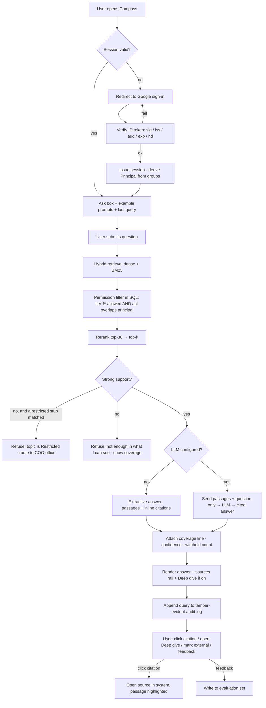
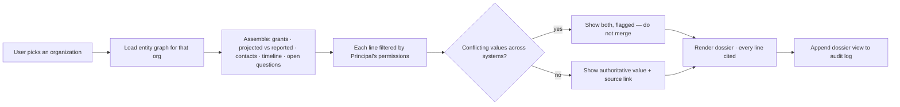
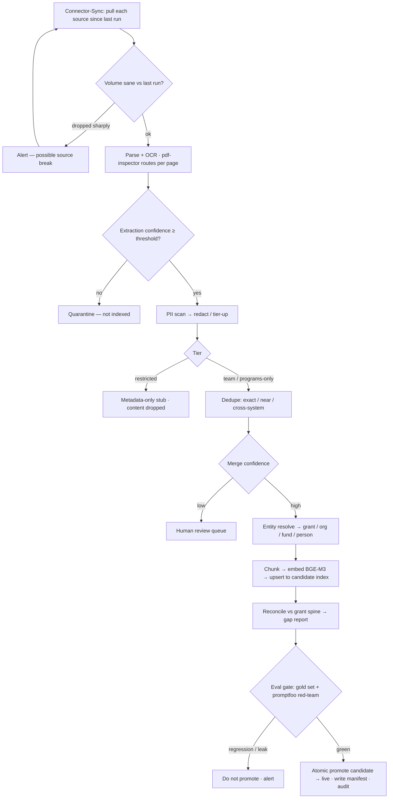
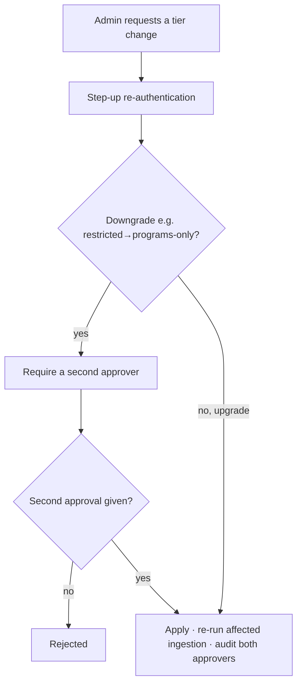

# Compass — User Flows & Journey Maps

Multimodal: the flows are the same on web, PWA, and native; layout adapts (see
`CROSS_PLATFORM.md`).

---

## Journey map — Program Officer, renewal prep (primary)

| Stage | Doing | Thinking | Feeling | Compass touchpoint | Opportunity |
|---|---|---|---|---|---|
| Trigger | Renewal review is on the calendar for a grantee | "How did they actually do vs. what they told us?" | Time-pressured | — | — |
| Old way | Open Drive, GivingData, Airtable in tabs; skim a folder of PDFs; ping a colleague on Zoom | "This will take the afternoon" | Resigned | — | Replace this entirely |
| Ask | Types the question into Compass | "Let's see if this is real" | Skeptical | Ask box + example prompts | Fast first result |
| Read | Reads a 4-line answer, checks two citations | "Okay, behind on volume, ahead on wage — and Matt flagged a revised ramp" | Warming up | Answer + sources rail + coverage line | Every claim one click from its source |
| Verify | Clicks `[3]` → lands on the exact sentence in the PO note, highlighted | "Good, it's not making this up" | Trust building | Deep-link citation | This is the trust moment |
| Extend | Opens Deep dive: no Year-2 report yet; ask Matt; draft email ready | "Right, I should confirm the revised target with Matt" | In control | Deep dive panel | Turns an answer into a next step |
| Act | Marks the answer "for external use" for the board memo; copies the draft email | "Ten minutes, not an afternoon" | Relieved | Verify banner + feedback | Measurable time saved |

---

## Core flow — Ask → cited answer

---

## Flow — Grantee dossier

---

## Flow — Ingestion (LangGraph, scheduled — no user)

---

## Flow — Admin: change a sensitivity tier

---

## Error & edge states (all surfaces)

| State | What the user sees |
|---|---|
| No matching content | "I don't have anything in what I can see that solidly answers this." + coverage line |
| Topic is Restricted | "This would require Restricted material (board / compensation / legal). Not indexed. Request via the COO's office." |
| Caller lacks permission | "N passages match but sit outside what you can retrieve here." |
| LLM unavailable | Falls back to an extractive answer, labelled as such |
| Stale index (sync failed) | Banner: "Last synced {time} — some recent changes may be missing" |
| Kill switch active | "Compass is paused. Sources are unaffected. Contact {owner}." |
